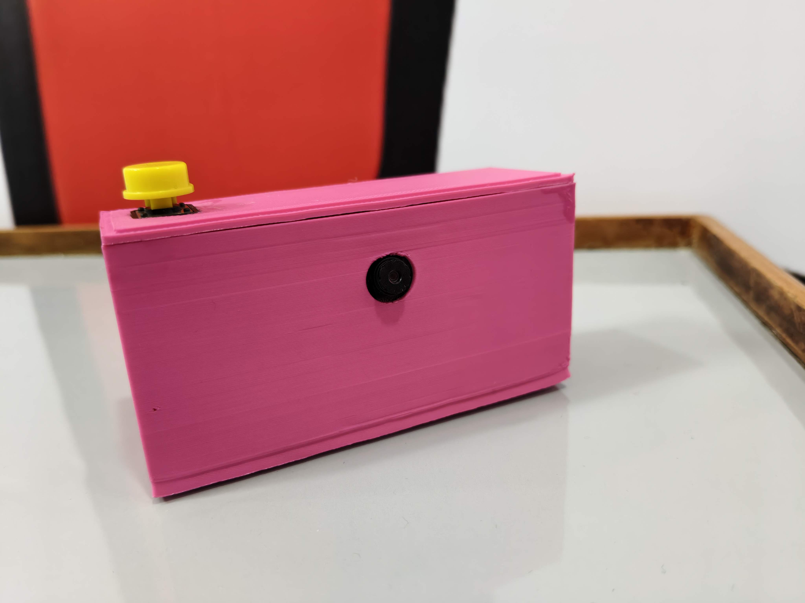
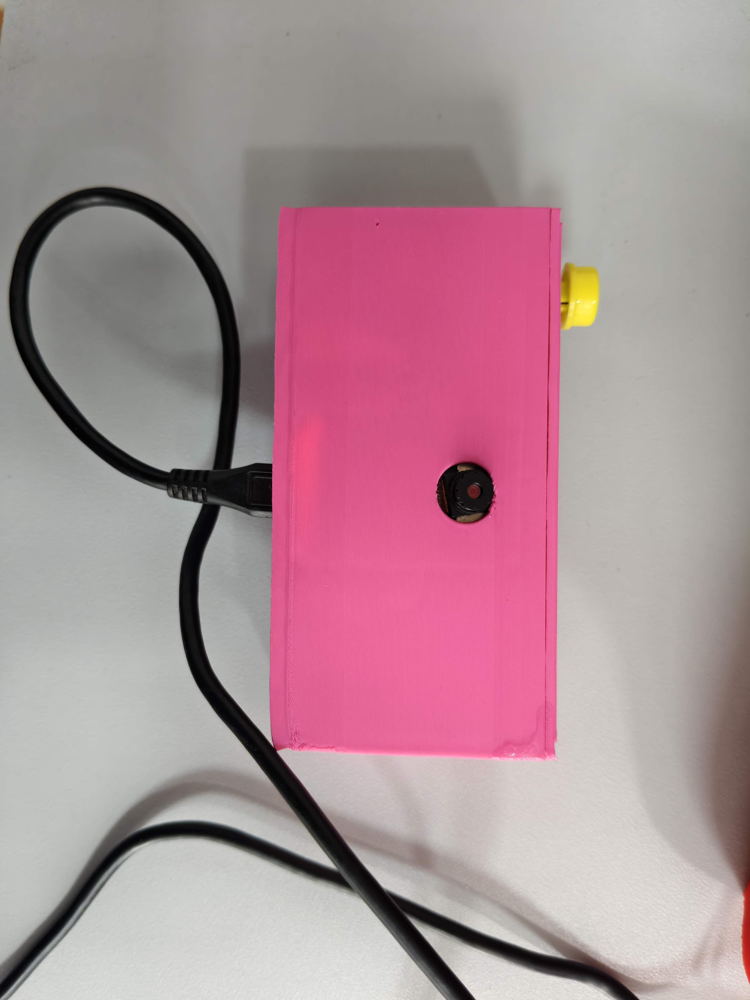
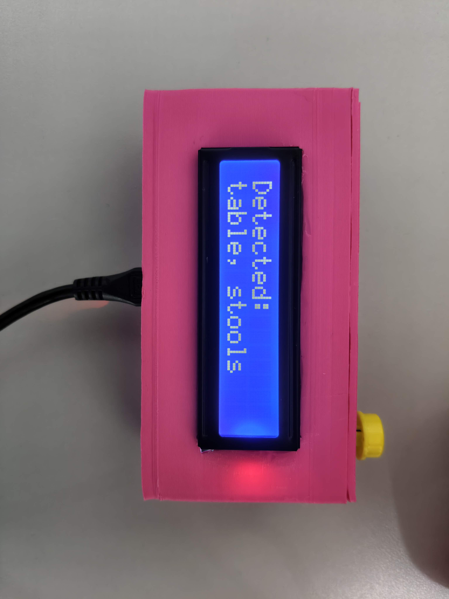
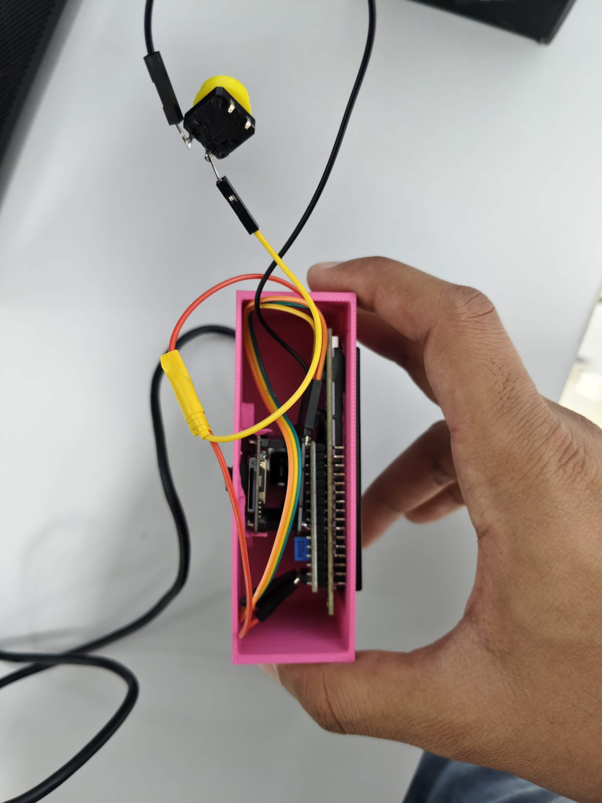

# 📸 AI Camera (ESP32-CAM + I2C LCD + OpenAI)

A DIY smart camera using **ESP32-CAM**, a **16x2 I2C LCD**, and **OpenAI's image recognition** via **n8n workflow**.

On a button press, the camera:
- Captures an image
- Sends it to OpenAI through n8n
- Displays the identified object(s) on both the **LCD screen** and **Serial Monitor**

---

## 🖼️ Project Preview

### Physical Build Image
<p align="center">
  
</p>

### Sample Output Images
<p align="center">
  
  
  
</p>


Upload your output images to the `images/` folder or link hosted images.

---

## 🔧 Features

- 📷 ESP32-CAM image capture
- 🌐 Sends image to OpenAI via n8n
- 🔘 Triggered by a button press
- 🧠 Object recognition from AI
- 💬 Results shown on I2C LCD (and Serial)

---

## 🧰 Components Required

| Component         | Description                        |
|------------------|------------------------------------|
| ESP32-CAM         | AI Thinker module recommended      |
| I2C LCD Display   | 16x2 with I2C (0x27 or 0x3F)        |
| Push Button       | Momentary button                   |
| 10kΩ Resistor     | For pull-down on button            |
| Jumper Wires      | M-M or M-F depending on headers    |
| Breadboard        | Optional for prototyping           |
| FTDI Programmer   | To flash the ESP32-CAM             |

---

## ⚙️ Wiring

| ESP32-CAM GPIO | Connects To        |
|----------------|--------------------|
| GPIO 14        | LCD SDA            |
| GPIO 15        | LCD SCL            |
| GPIO 12        | Push Button (to GND)|
| 5V             | LCD VCC            |
| GND            | LCD GND & Button   |

> ⚠️ Disconnect LCD (GPIO14/15) while flashing code.

---

## 🖥️ LCD Setup

- **I2C Address**: 0x27 (default)
- **Library**: `LiquidCrystal_I2C` (install via Library Manager)
- **Connection**: SDA to GPIO14, SCL to GPIO15

---

## 🔗 Software Stack

- **ESP32-CAM**: Captures image
- **n8n Workflow**: Receives image and sends to OpenAI
- **OpenAI Vision API**: Identifies objects
- **LCD**: Displays results
- **Serial Monitor**: Debug output

---

## 📋 Example Output

### Serial Monitor
WiFi connected.  
Button Pressed: Sending image...  
Server response:  
`{"content":"mug, headset"}`

### LCD Display
Detected:  
mug, headset

---

## 🧠 OpenAI Prompt (in n8n)

> Prompt used to analyze the image:  
Describe the main object(s) in this image. If the image is blurry or unclear, guess as best you can. Focus on naming the main visible object(s). If unsure, return one or two large visible items.

---

## 🪛 Setup Instructions

1. Flash the Arduino code to your ESP32-CAM (disconnect I2C pins during flashing).
2. Connect LCD and button after upload.
3. Set up your **n8n** workflow to:
   - Receive binary image
   - Send to OpenAI Vision API
   - Return JSON like `{"content":"mug, headset"}`

---

## 🧪 Troubleshooting

- **LCD not working**: Scan I2C address; try 0x3F if 0x27 fails
- **Upload errors**: Disconnect GPIO14/15 (used for I2C) before flashing
- **No AI response**: Check your n8n webhook and OpenAI setup

---

## 📁 Folder Structure

```
ai-camera/
├── ai_camera.ino              # Main Arduino code
├── README.md                  # This file
├── images/
│   ├── ai-camera-setup.jpg    # Physical camera photo
│   ├── sample1.jpg            # Example output image 1
│   ├── sample2.jpg            # Example output image 2
│   └── sample3.jpg            # Example output image 3
└── n8n_workflow.json          # (Optional) export of your n8n flow
```

---

## 💡 Ideas for Improvement

- Motion detection trigger instead of button
- Battery-powered portable setup
- Image logging to SD card
- OLED or TFT display instead of LCD

---

## 👤 Author

**Project by:** Lav Kalsi 
**Inspired by:** ESP32-CAM, OpenAI Vision, and DIY hardware innovation

---

## 🪪 License

MIT License — free to use, modify, and share for educational and personal projects.
